# 📹 CamView – UX/UI Rediseño Caso de Estudio

> **Rol:** Frontend Developer / UX Thinker  
> **Contexto:** Rediseño de producto en producción  
> **Enfoque:** UX, UI, navegación, eficiencia y mobile-first 

## Antes vs Después

### 📱 Mobile

| Antes | Después |
|------|--------|
|  |  |

| Navegación (Antes) | Navegación (Después) |
|-------------------|---------------------|
|  |  |

---
### 💻 Desktop

| Antes | Después |
|------|--------|
|  | 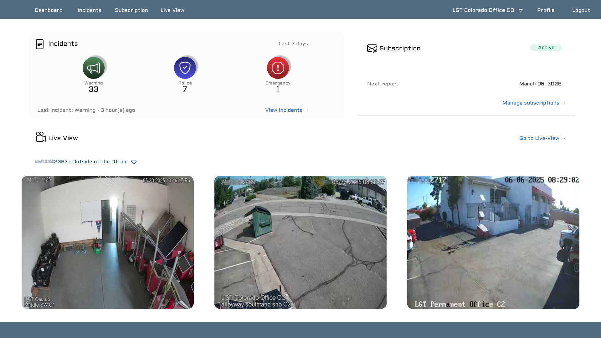 |

| Navegación (Antes) | Navegación (Después) |
|-------------------|---------------------|
| 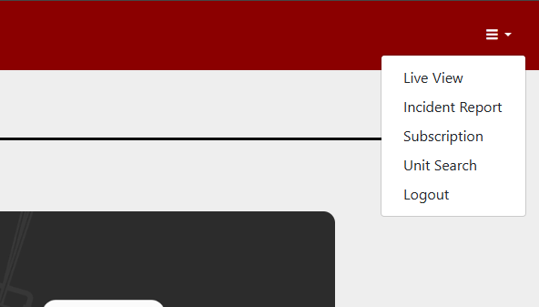 |  |

---

## Contexto

CamView es una web app que permite a usuarios monitorear cámaras de seguridad en tiempo real, consultar reportes e interactuar con diferentes funcionalidades del sistema.

A partir del uso continuo del producto, se detectaron múltiples fricciones en la experiencia, especialmente en navegación, consumo de información y uso en dispositivos móviles.

Este rediseño busca mejorar la claridad, eficiencia y accesibilidad del sistema.

---
## Problemas detectados

### 📱 Mobile

- ❌ Tablas no responsivas y difíciles de consumir  
- ❌ Navegación oculta con múltiples pasos  
- ❌ Interacción táctil poco optimizada  
- ❌ Saturación de información sin jerarquía  

---

### 💻 Desktop

- ❌ Layout poco estructurado  
- ❌ Uso ineficiente del espacio  
- ❌ Falta de consistencia visual  
- ❌ Dificultad para identificar acciones clave  

---
## ⚖️ Comparativas clave (Decisiones de diseño)

### 🔹 Navegación

| Antes | Después |
|------|--------|
|  |  |

**Problema:**  
- Navegación oculta y poco accesible  

**Solución:**  
- Sidebar persistente y estructurada por secciones  

**Impacto:**  
- Acceso más rápido a features  
- Reducción de fricción en navegación  

---
### 🔹 Reportes

| Antes | Después |
|------|--------|
|  |  |

**Problema:**  
- Tablas difíciles de leer y usar en mobile  

**Solución:**  
- Rediseño visual + filtros dedicados  

**Impacto:**  
- Mejor lectura  
- Mayor eficiencia en análisis  

---
### 🔹 Suscripción

| Antes | Después |
|------|--------|
| 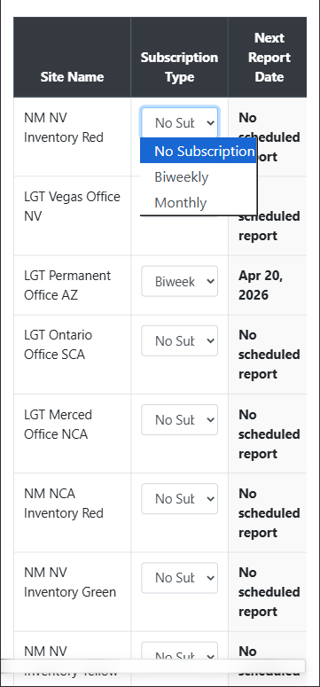 | 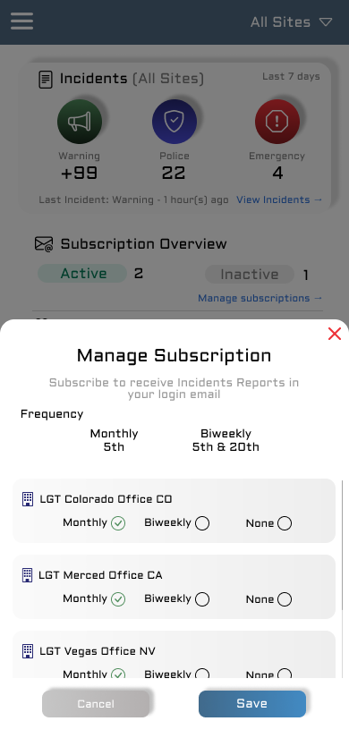 |

**Problema:**  
- Flujo largo y separado  

**Solución:**  
- Conversión a modal contextual  

**Impacto:**  
- Menos pasos  
- Interacción más rápida  

---
### 🔹 Búsqueda de unidades

| Antes | Después |
|------|--------|
| 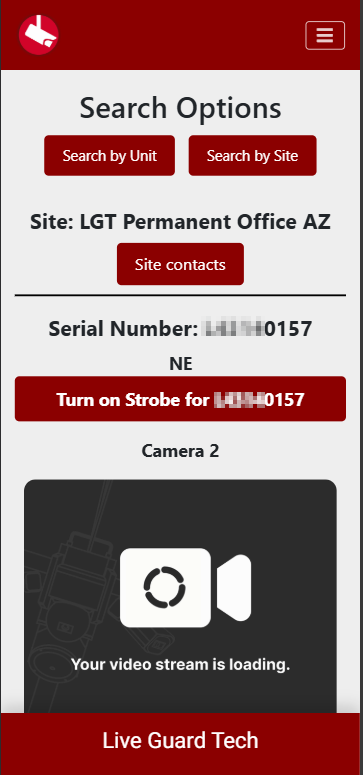 | 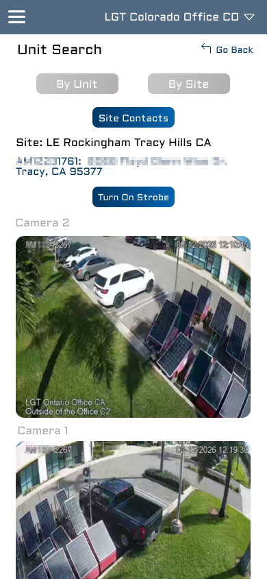 |

**Problema:**  
- Flujo poco claro  

**Solución:**  
- Flujo optimizado + resultados claros  

**Impacto:**  
- Mejor experiencia de búsqueda  
- Reducción de confusión  

---
## ✨ Resultado final (Nueva experiencia)

### 📱 Mobile

- Dashboard centralizado  
- Sidebar accesible  
- LiveView optimizado  
- Filtros en reportes (nuevo feature)  
- Búsqueda mejorada  
- Modales para acciones rápidas  

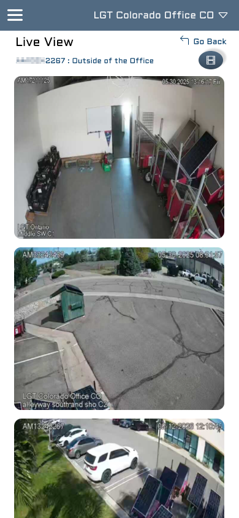
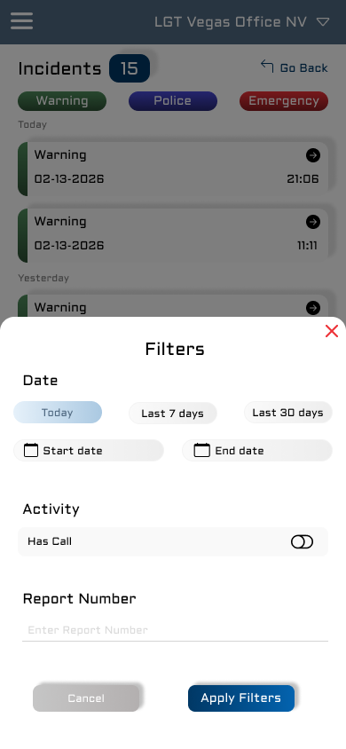
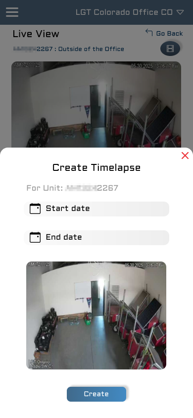

---
### 💻 Desktop

- Navbar fija  
- Mejor uso del espacio  
- Jerarquía visual clara  
- Consistencia entre vistas  

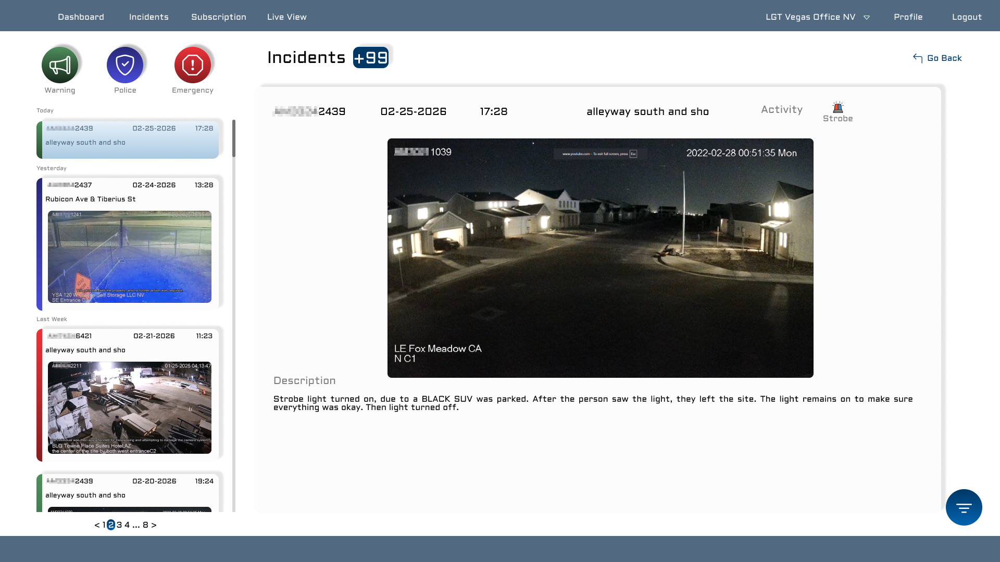
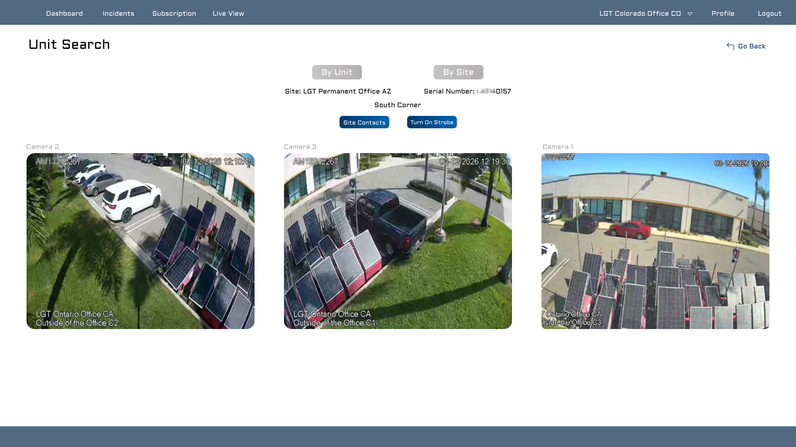

---
## 🧠 Decisiones de diseño

- **Sidebar persistente** → reduce carga cognitiva y mejora navegación  
- **Dashboard** → centraliza información crítica  
- **Modales** → reducen fricción en flujos importantes  
- **Mobile-first** → asegura experiencia consistente en todos los dispositivos  
- **Filtros en reportes** → permiten análisis más eficiente  
- **Mejor jerarquía visual** → facilita lectura y toma de decisiones  

---
## 🎯 Resultado / Impacto

Este rediseño transforma la experiencia de CamView en:

- ✔ Navegación clara y accesible  
- ✔ Reducción de pasos en tareas clave  
- ✔ Mejor consumo de información  
- ✔ Experiencia consistente entre dispositivos  
- ✔ Mayor enfoque en acciones principales del usuario  

---
## Conclusión

Este proyecto no solo representa un cambio visual, sino una mejora integral en la experiencia del usuario, enfocada en eficiencia, claridad y escalabilidad del producto.

Refleja un enfoque centrado en el usuario y en la toma de decisiones basadas en problemas reales del sistema.

---