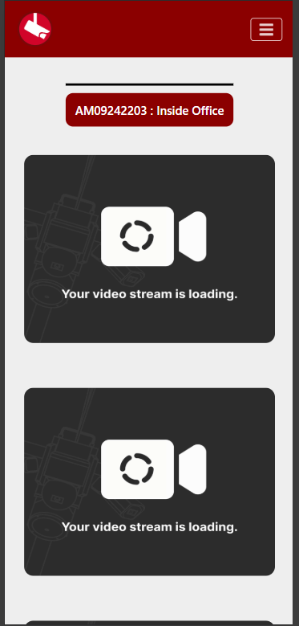
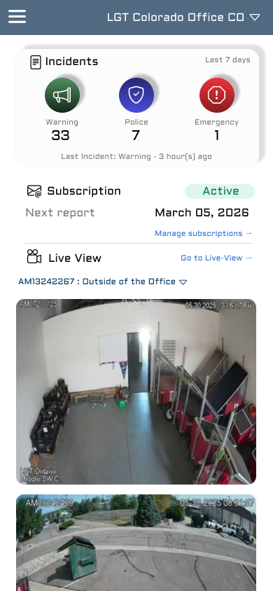
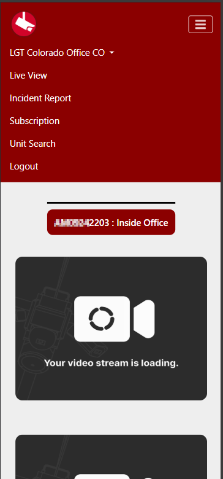
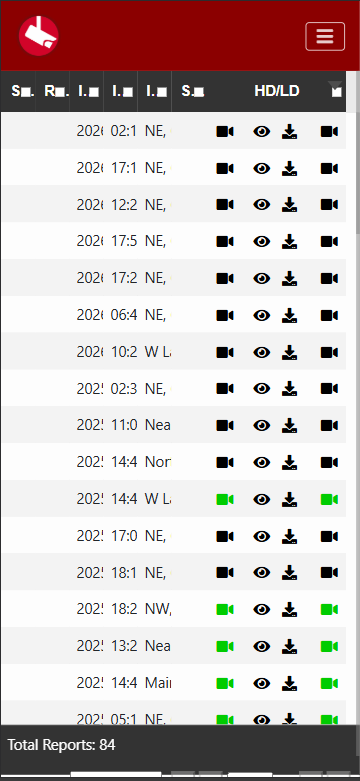
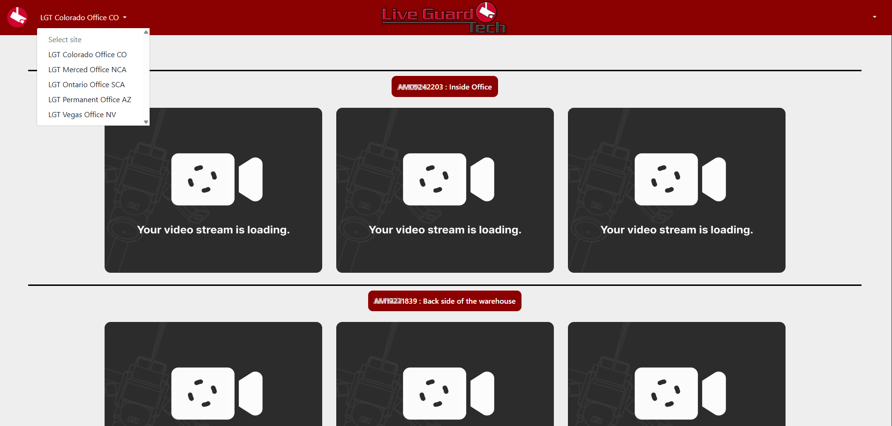

# 📹 CamView – UX/UI Rediseño Caso de Estudio

> **Rol:** Frontend Developer / UX Thinker  
> **Contexto:** Rediseño de producto en producción  
> **Enfoque:** UX, UI, navegación, eficiencia y mobile-first 

## ✨ Antes vs Después (Impacto inmediato)

### 📱 Mobile

| Antes | Después |
|------|--------|
|  |  |

| Navegación (Antes) | Navegación (Después) |
|-------------------|---------------------|
|  |  |

---

## Introducción

CamView es una web app utilizada por clientes para monitorear en tiempo real sus cámaras de seguridad, revisar incidentes y gestionar suscripciones de reportes.

A partir del uso continuo del producto, se identificaron múltiples fricciones en la experiencia de usuario, especialmente en navegación, visualización de información y uso en dispositivos móviles.

Este caso de estudio documenta el rediseño completo de la experiencia, enfocado en mejorar claridad, accesibilidad y eficiencia en la interacción.

---
## Problema

La aplicación presentaba varios problemas críticos de UX/UI:

- Navegación poco intuitiva basada en dropdown
- Mala adaptación a dispositivos móviles
- Uso excesivo de tablas difíciles de leer
- Falta de jerarquía visual
- Experiencia fragmentada entre features

Esto generaba:

- Confusión en usuarios
- Mayor tiempo para encontrar información
- Baja eficiencia en tareas clave

---

## 🔍 Análisis del sistema actual

### 📱 Mobile (versión actual)

- Navegación oculta en menú poco accesible
- Tablas no responsivas
- Difícil interacción táctil
- Saturación de información

---

### 💻 Desktop (versión actual)

- Layout poco estructurado
- Falta de consistencia visual
- Uso ineficiente del espacio

---
## 💡 Propuesta de solución

Se realizó un rediseño completo basado en principios de UX:

- Jerarquía visual clara
- Navegación persistente
- Mobile-first design
- Componentización de UI
- Reducción de carga cognitiva

---
## Nueva navegación

### Antes
- Menú tipo dropdown
- Difícil acceso a features

### Después
- Sidebar estructurada por secciones:

**Main**
- Dashboard  

**Features**
- LiveView  
- Subscription  
- Unit Search  

**Account**
- Profile  

- Logout separado visualmente

---
### 📱 Mobile / Tablet

- Sidebar accesible desde botón
- Header con selector de sitio dinámico
- Navegación clara y consistente
- Mejora sustancial en interfaz de usuario
---

### 💻 Desktop

- Sidebar fija
- Header con selector de sitio + perfil
- Mejor distribución del espacio

---

s