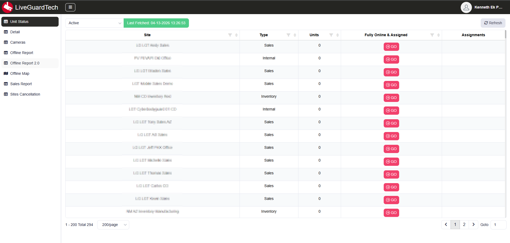
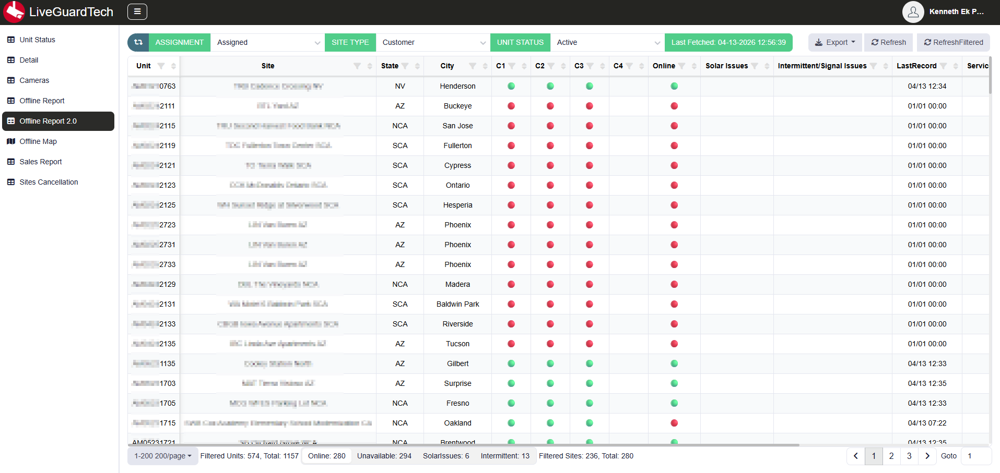
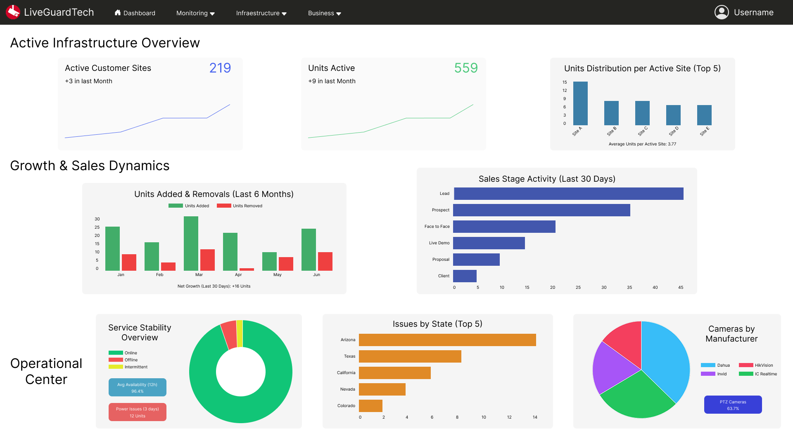
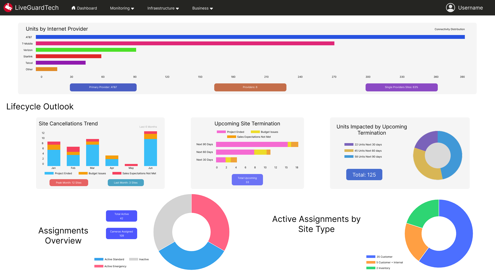

# Dashboard App – From Tables to Decision-Making

> 🛠️ Rol: Frontend Developer / UX/UI Designer  
> 🎯 Enfoque: Data visualization, navegación y experiencia de producto  
> 🧠 Objetivo: Transformar datos en insights accionables  

---
---

## Contexto

La aplicación estaba compuesta por múltiples secciones enfocadas en monitoreo, infraestructura y negocio.

Sin embargo, todas compartían el mismo problema:

> La información existía, pero no era útil para tomar decisiones.

---
## ⚠️ Problema

El sistema estaba basado completamente en tablas:

- Alta densidad de datos
- Difícil lectura
- Sin jerarquía visual
- Sin insights claros

---
### Antes: experiencia basada en tablas

El usuario debía:

- Interpretar manualmente la información  
- Navegar entre múltiples páginas  
- Construir sus propias conclusiones  

---
## 💡 Insight clave

> “No necesitamos más datos, necesitamos mejor interpretación de los datos.”

---

## 🧭 Reestructuración de navegación

Se rediseñó completamente la arquitectura:

### Antes
- Sidebar con múltiples opciones sin agrupación clara

### Después
- Navbar con estructura lógica por dominio:

**Monitoring**
- Offline Map  
- Offline Report  
- Offline Report 2.0  

**Infrastructure**
- Sites  
- Units  
- Cameras  

**Business**
- Sales Report  
- Sites Cancelation 

### Agrupar por contexto permite:

- Escalabilidad
- Mejor descubrimiento
- Reducción de carga cognitiva

---

### 🖥️ Nueva navegación

---
## 📊 El cambio: un verdadero Dashboard

Se diseñó una nueva página principal enfocada en:

> Visualizar el estado del negocio en segundos

---

### Vista general del Dashboard

---

## Sistema de Widgets

Los widgets fueron diseñados como unidades de información clara, agrupadas por propósito:

### Active Infrastructure Overview

- Estado actual de infraestructura
- Visibilidad inmediata de activos

### Growth & Sales Dynamics

- Tendencias de crecimiento
- Métricas clave de negocio

### Operational Center

- Monitoreo operativo
- Detección de problemas

### Lifecycle Outlook

- Estado de sitios
- Ciclo de vida de clientes

---
## 🎯 Principios aplicados

- Jerarquía visual clara  
- Reducción de carga cognitiva  
- Agrupación por contexto  
- Diseño orientado a decisiones  
- Escaneo rápido de información  

---
## 📈 Impacto

- Reducción del tiempo de análisis  
- Mayor claridad en métricas clave  
- Mejora en toma de decisiones  
- Experiencia más intuitiva  

---

## Aprendizajes

- Un dashboard no es una colección de datos, es una herramienta de decisión  
- La navegación define cómo se entiende el sistema  
- Agrupar información correctamente es tan importante como diseñarla  
- UX también es cómo se interpretan los datos  

---
## Notas

Este rediseño fue conceptualizado y diseñado como una mejora estructural del producto existente, enfocado en escalabilidad y claridad.