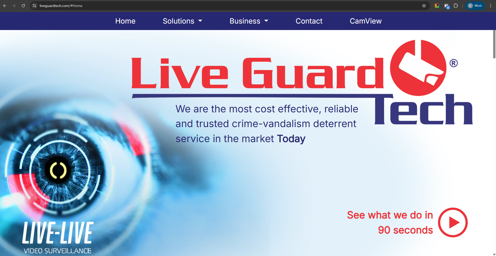
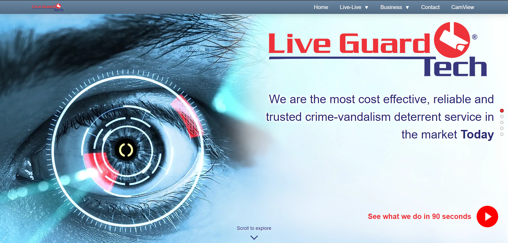
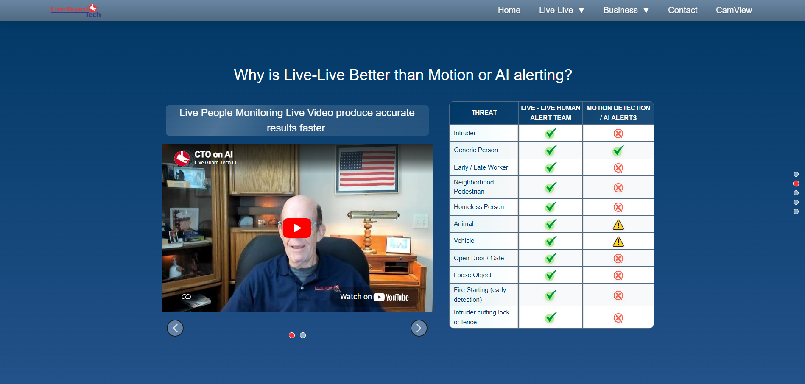
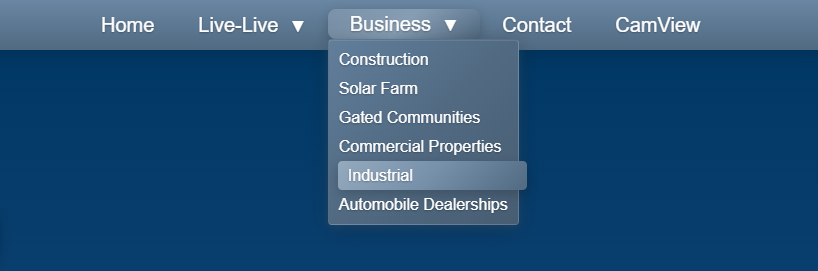

# Website – Rediseño UI

> 🛠️ Rol: Frontend Developer / UI Designer  
> 🎯 Enfoque: UI, branding y percepción de producto  
> 🔗 Sitio en producción: [Ver sitio web](https://www.liveguardtech.com/)

---
## Contexto

El sitio web corporativo es el primer punto de contacto entre la empresa y potenciales clientes.

Sin embargo, la versión existente no reflejaba el nivel de profesionalismo del servicio ofrecido.

---

## ⚠️ Problema

El diseño anterior presentaba:

- Estética desactualizada  
- Falta de jerarquía visual  
- Uso inconsistente de colores  
- Baja claridad en el contenido 
- Problemas de responsividad en distintos 

---

## Antes

El sitio generaba:

- Baja confianza visual  
- Dificultad para entender la propuesta de valor  
- Experiencia poco atractiva  

---
## 🎯 Objetivo

> Crear una experiencia moderna, clara y profesional que refleje la calidad del servicio.

---
## Rediseño

Mejora sustancial en el diseño y en los efectos hover de la navbar

### Nueva identidad visual
- Paleta basada en tonos azules
- Mayor contraste y legibilidad

## Tipografía
- Mejor jerarquía de información

### Layout
- Secciones bien definidas
- Uso de espacios en blanco
- Mejor escaneo visual

### Navegación
- Más clara e intuitiva
- Acceso rápido a secciones clave

---

## Comparativa

### Antes vs Después

/*Pendiente imgs*/

---

## Impacto

- Mejora en percepción de marca  
- Mayor claridad en servicios ofrecidos  
- Experiencia más profesional  
- Mejor primera impresión para clientes 

## Aprendizajes

- La UI define la confianza del usuario  
- Un buen diseño comunica antes que el contenido  
- La simplicidad mejora la experiencia  
- El diseño web también es una herramienta de negocio  

---

## 🔗 Ver sitio en vivo

https://www.liveguardtech.com
