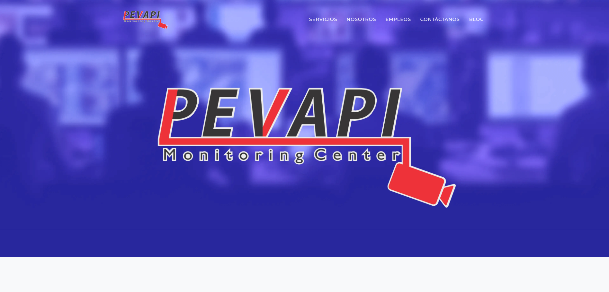
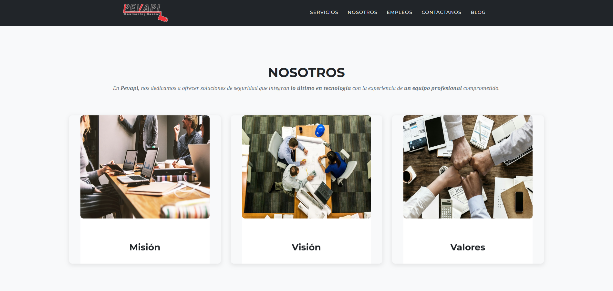
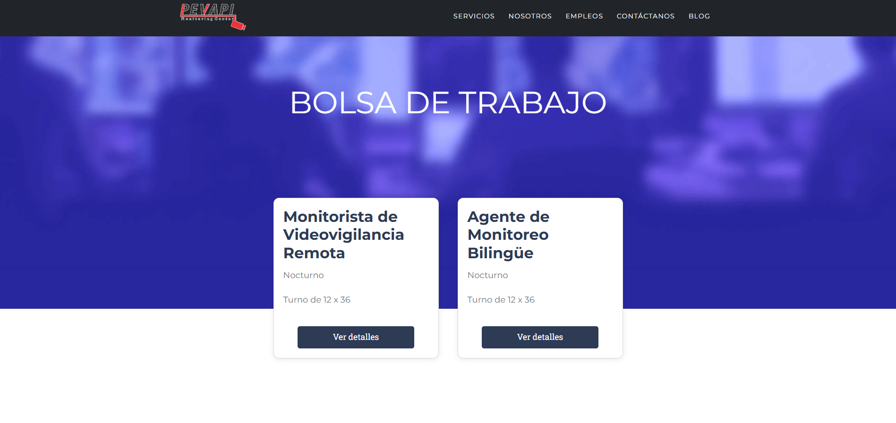
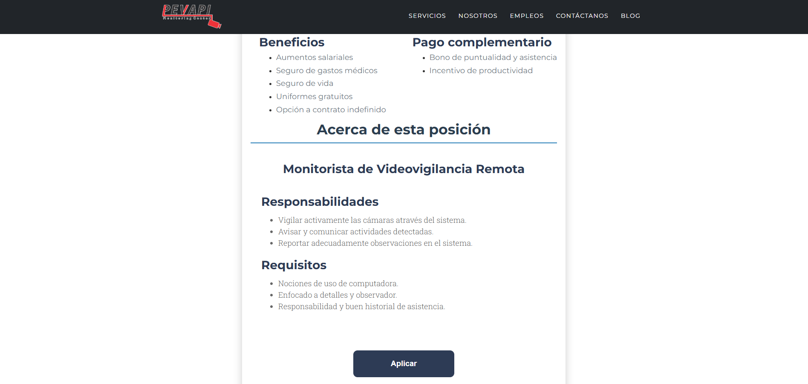
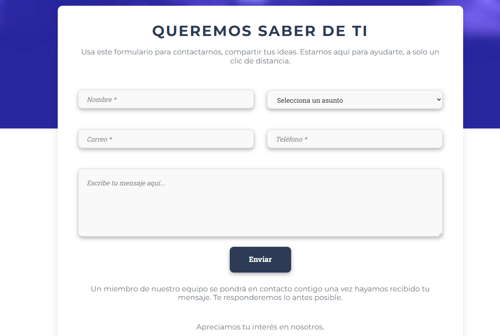
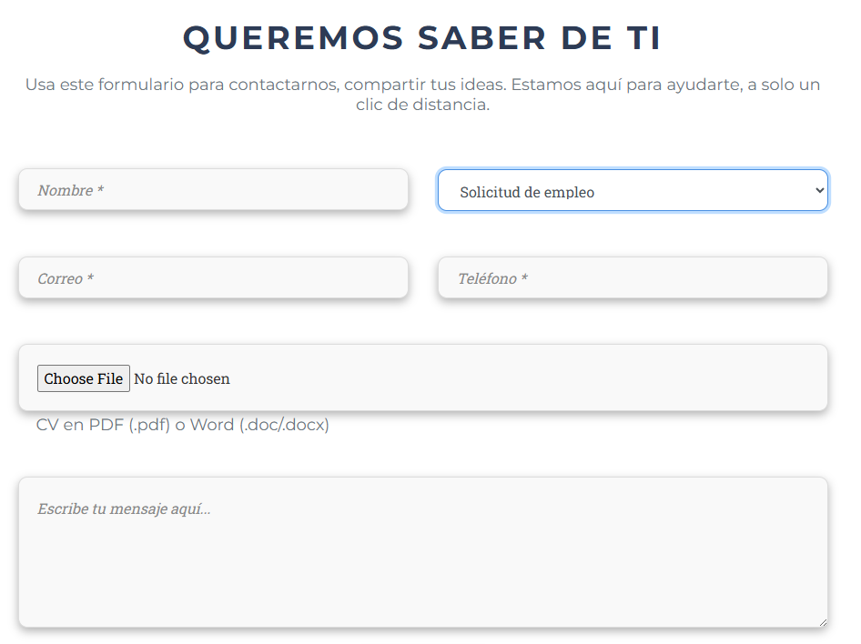

# 🌐 Company Website – Landing & Hiring Flow Case Study

> 🛠️ Rol: Frontend Developer  
> ⚙️ Tecnología: Orchard Core CMS  
> 🎯 Enfoque: UX, conversión y automatización de procesos  
> 🔗 Sitio en producción: [Ver sitio web](https://pevapi.com/  )

## Contexto

Se desarrolló un sitio web corporativo enfocado en:

- Presentar servicios  
- Comunicar la identidad de la empresa  
- Facilitar el reclutamiento de talento  

El objetivo principal fue crear una experiencia simple pero efectiva que guiara al usuario desde la exploración hasta la conversión.

---

## Objetivo

> Diseñar una landing page clara y funcional que permita convertir visitantes en contactos o candidatos de manera eficiente.

---

## Estructura del sitio

La landing se compone de cuatro secciones principales:

- **Hero (imagen principal)**
- **Servicios**
- **Nosotros**
- **Empleos**

---

## Diseño de la experiencia

### Landing Page

- Diseño limpio y moderno  
- Jerarquía visual clara  
- Navegación sencilla  

---
### Sección "Nosotros"

- 3 cards informativas  
- Cada una abre un modal con más detalles  
- Interacción ligera sin cambiar de página  

---
### Pagina de Empleos

- Listado de vacantes en formato card  
- Información resumida y fácil de escanear  

---
### Detalle de empleo

- Información completa de la vacante  
- CTA claro: **Aplicar**

---

## Flujo de aplicación (core del proyecto)

Este es el punto más importante del sistema:

---

### Flujo UX

1. Usuario explora el sitio  
2. Navega a **Empleos**  
3. Selecciona una vacante  
4. Hace clic en **Aplicar**  
5. Es dirigido al formulario de contacto  

---

### Formulario inteligente

El formulario incluye:

- Nombre  
- Teléfono  
- Correo  
- Tipo de solicitud:
  - Duda  
  - Queja  
  - Sugerencia  
  - **Solicitud de empleo**  

---
### Comportamiento dinámico

- Al seleccionar **Solicitud de empleo**:
  - Se activa un campo adicional para subir documentos  
- Mejora la experiencia al mostrar solo lo necesario  

---
## ⚙️ Automatización

- Los datos enviados son procesados automáticamente  
- Las solicitudes de empleo llegan directamente a **Recursos Humanos**  
- Se elimina fricción en el proceso de reclutamiento  

---

## Decisiones clave

- Mantener una arquitectura simple  
- Priorizar claridad sobre complejidad  
- Diseñar un flujo sin pasos innecesarios  
- Implementar lógica condicional en UI  

---
## 📈 Impacto

- Facilita la captación de talento  
- Reduce fricción en el proceso de aplicación  
- Mejora la experiencia del usuario  
- Automatiza procesos internos  

---
## Aprendizajes

- Una landing efectiva no necesita ser compleja  
- El valor está en el flujo, no solo en la UI  
- Los formularios dinámicos mejoran la conversión  
- Integrar frontend con procesos reales genera impacto directo  

---

## 🔗 Ver sitio en vivo

https://pevapi.com/

---

> ✨ Este proyecto se encuentra en producción y es utilizado activamente como canal de contacto y reclutamiento.